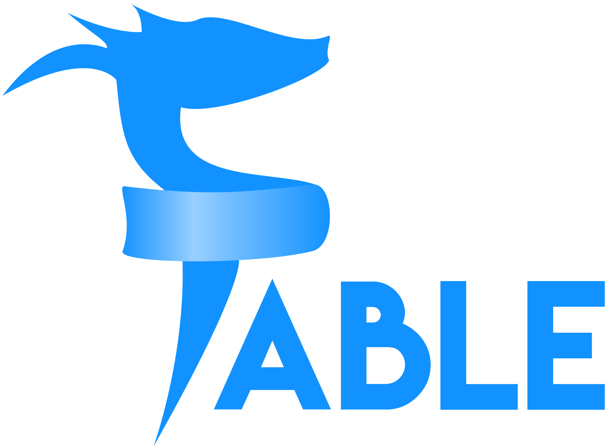

# FableStarter



An Elmish F# [Fable](https://fable.io) template which uses [Tailwind](https://tailwindcss.com) for styling, the [Vite](https://vitejs.dev) bundler, the [Vitest](https://vitest.dev) test runner and [Storybook](https://storybook.js.org) for [Component-Driven Development](https://www.componentdriven.org) (CDD).

* Uses [Fable.Remoting](https://zaid-ajaj.github.io/Fable.Remoting/#/) with [Saturn](https://saturnframework.org/explanations/overview.html)
* Inspired by [RedwoodJS File Structure](https://redwoodjs.com/docs/tutorial/chapter1/file-structure)

## Install pre-requisites

You'll need to install the following pre-requisites in order to use the Fable Starter template:

- [.NET 6.0 SDK](https://dotnet.microsoft.com/download/dotnet/6.0)
- [Node](https://nodejs.org/en/download/)
- [Yarn](https://classic.yarnpkg.com/lang/en/)

## Getting Started with FableStarter

Use [degit](https://github.com/Rich-Harris/degit) to set up the template:

```bash
npx degit rastreus/FableStarter <your project name>
```

Run the following commands from the root of the project directory:

0. `cd <your project name>`

1. `dotnet tool restore`

2. `dotnet paket install`

3. `yarn install`

4. `dotnet build shared/src/Shared.fsproj`

5. `dotnet build api/src/Api./fsproj`

6. `dotnet run --project api/src/Api.fsproj`

7. `yarn dev:fable`

8. Open a brower to `http://localhost:5173`

## Running Tests

Tests can be run by Vitest in its watch mode. Open a separate terminal instance and run `yarn test`.

Check out [Fable.Expect](https://github.com/fable-compiler/Fable.Expect) to learn more about defining tests.

More testing resources:

- [Testing documentation](https://fable.io/docs/your-fable-project/testing.html)
- [Fable.Jester](https://github.com/Shmew/Fable.Jester)
- [Fable.Mocha](https://github.com/Zaid-Ajaj/Fable.Mocha)

## Running Storybook

Similar to tests, Storybook can run in its watch mode in a separate terminal instance with `yarn storybook`.

Check out the [Storybook Docs](https://storybook.js.org/docs/react/get-started/introduction) and their [Storybook for React tutorial](https://storybook.js.org/tutorials/intro-to-storybook/react/en/get-started/) to learn more about writing stories for components.

---

## Other Templates

If this template isn't what you're wanting, there are other templates. Some only set up a frontend Fable project and then others are full-stack web app templates that include a F# backend:

- [MangelMaxime/template-gitpod-fable-3-vite-react](https://github.com/MangelMaxime/template-gitpod-fable-3-vite-react)
- [fable-compiler/fable-templates](https://github.com/fable-compiler/fable-templates)
- [albertwoo/FablePlayground](https://github.com/albertwoo/FablePlayground)
- [Bjorn-Strom/elmish-fss-template](https://github.com/Bjorn-Strom/elmish-fss-template)
- [SAFE-Stack/SAFE-template](https://github.com/SAFE-Stack/SAFE-template)
- [Zaid-Ajaj/SAFE.React](https://github.com/Zaid-Ajaj/SAFE.React)
- [Dzoukr/SAFEr.Template](https://github.com/Dzoukr/SAFEr.Template)

Additional templates can be found at [https://fable.io/resources.html#Templates](https://fable.io/resources.html#Templates)
