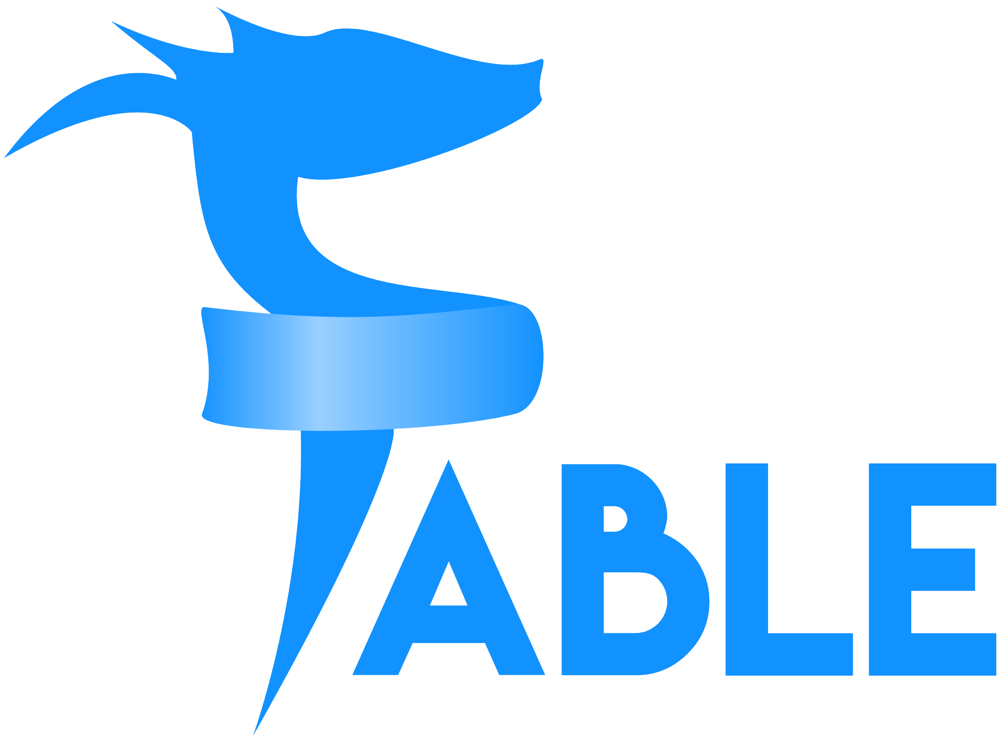

# FableStarter

An Elmish F# [Fable](https://fable.io) template that uses [Tailwind](https://tailwindcss.com) for styling and the [Parcel](https://parceljs.org) bundler.

_Updated with Tailwind CSS v3.0. Check out their release [blog post](https://tailwindcss.com/blog/tailwindcss-v3) to learn more._

## Install pre-requisites

You'll need to install the following pre-requisites in order to use the Fable Starter template:

- [.NET 6.0 SDK](https://dotnet.microsoft.com/download/dotnet/6.0)
- [Node](https://nodejs.org/en/download/)
- [Yarn](https://classic.yarnpkg.com/lang/en/)

## Getting Started with FableStarter

Run the following commands from the root of the project directory:

1. `dotnet tool restore`

2. `yarn install`

3. `dotnet build`

4. `dotnet fable --noCache --sourceMaps`

5. `yarn dev:start`

6. Open your brower to `http://localhost:1234`

## Other Templates

If this template isn't what you're wanting, there are other templates. Some only set up a frontend Fable project and then others are full-stack web app templates that include a F# backend:

- [fable/compiler/fable-templates](https://github.com/fable-compiler/fable-templates)
- [albertwoo/FablePlayground](https://github.com/albertwoo/FablePlayground)
- [Bjorn-Strom/elmish-fss-template](https://github.com/Bjorn-Strom/elmish-fss-template)
- [SAFE-Stack/SAFE-template](https://github.com/SAFE-Stack/SAFE-template)
- [Zaid-Ajaj/SAFE.React](https://github.com/Zaid-Ajaj/SAFE.React)
- [Dzoukr/SAFEr.Template](https://github.com/Dzoukr/SAFEr.Template)

Additional templates can be found at [https://fable.io/resources.html#Templates](https://fable.io/resources.html#Templates)
